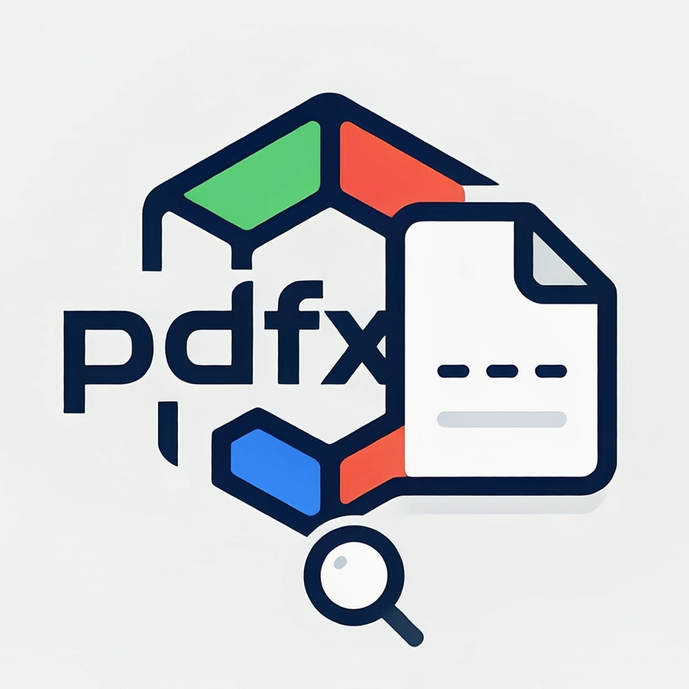

<div align="center">
  <a href="https://github.com/bryantaolong/pdfx">
    
  </a>
</div>

**PDFX** empowers you to merge, split and extract PDF files direct in your terminal.

---

## ✨ Features

* Merge all PDF files in a directory into one file
* Split a PDF into two files at a specified page number
* Extract specified pages from a PDF and merge them into a new file
* Color-coded output for easy operation feedback

---

## 🚀 Installation & Build

### 1. Install Go

Make sure Go is installed and environment variables are set:

```bash
go version
```

### 2. Clone the repository

```bash
git clone https://github.com/bryantaolong/pdfx.git
cd pdfx
```

### 3. Build the executable

#### Windows

```powershell
go build -o pdfx.exe
```

#### Linux / macOS

```bash
go build -o pdfx
```

> Optional: Add the executable to your system PATH for global usage.

---

## 🎮 Usage

### Help

```bash
pdfx --help
pdfx merge --help
pdfx split --help
pdfx extract --help
pdfx version --help
```

### Merge PDFs

Merge all PDF files in a directory into one file:

```bash
# Merge all PDFs in current directory
pdfx merge --output merged.pdf

# Merge PDFs from a specific directory
pdfx merge -d /path/to/pdfs -o merged.pdf
```

### Split PDF

Split a PDF into two files at a specified page number:

```bash
pdfx split --name input.pdf --from 10
```

This splits `input.pdf` into:
* `input_1-9.pdf` (pages 1-9)
* `input_10-end.pdf` (pages 10 to end)

### Extract PDF

Extract specified pages from a PDF and merge them into a new file:

```bash
pdfx extract --name input.pdf --pages 1,3,5 --output extracted.pdf
```

---

## Example

```bash
# Merge all PDFs in a directory
pdfx merge -d ./docs -o combined.pdf

# Split a PDF at page 15
pdfx split -n book.pdf -f 15

# Extract pages 1, 2, and 3
pdfx extract -n book.pdf -p 1,2,3 -o chapters.pdf
```

---

## Project Structure

```
pdfx/
├─ cmd/           # Cobra command modules
│  ├─ root.go
│  ├─ version.go
│  └─ commands/
│     ├─ util.go
│     ├─ merge.go
│     ├─ split.go
│     └─ extract.go
├─ logo/          # Logo assets and icon workflow
├─ main.go
└─ README.md
```

---

## 💾 Notes

* Page numbers are 1-based in all commands
* The `--from` flag in `split` indicates the start page of the second file
* The `--pages` flag in `extract` accepts comma-separated page numbers

---

## License

[MIT License](./LICENSE)
